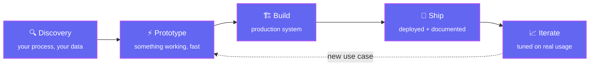

 

## 🧠 What I build

Off-the-shelf AI tools are built for everyone, which means they're built for no one.
I build the other kind — AI applications shaped around **your** process, **your** data
and **your** tools, then engineered to survive production.

<table>
<tr>
<td width="50%" valign="top">

### 🤖 Custom AI agents & assistants
Agents that actually *do* the work instead of just talking about it — wired into
your internal tools through **MCP servers** and tool-calling, running multi-step
workflows with a human in the loop wherever the action is irreversible.

</td>
<td width="50%" valign="top">

### 📚 RAG & document intelligence
Answers grounded in your own documents, with citations. Contract, invoice and
report extraction; semantic search across an internal knowledge base; pipelines
that stay accurate as the corpus grows.

</td>
</tr>
<tr>
<td width="50%" valign="top">

### ⚙️ AI workflow automation
Dropping AI into a process you already run — triage, classification, summarisation,
report generation, back-office paperwork. Measured against the manual baseline it
replaces, not against a demo.

</td>
<td width="50%" valign="top">

### 🎙️ Voice & meeting AI
Speech-to-text and multilingual transcription that can run **fully offline** when the
audio can't leave the building, plus automatic minutes, action items and summaries.

</td>
</tr>
</table>

## 🚀 How we'd work together

No six-month discovery phase. You see something working early, and every step after
that is a decision you get to make with real output in front of you.

## 🛠️ Stack

**AI & models**

 

**Engineering**

 

## ✅ AI that survives contact with production

Anyone can demo a prompt. The hard part is the system around it — and that's the part
I'm good at.

- **Tested like infrastructure.** A recent backend runs **3,277 statements at 100% line +
  branch coverage** behind a hard CI gate — no `pragma: no cover`, no exclusions — with
  `mypy --strict` and `ruff` clean on every commit.
- **Designed before it's built.** That system had **17 component specs and 56 architecture
  diagrams** written before the first line of code.
- **Safe by default.** Secrets envelope-encrypted at rest, append-only audit trails,
  idempotent writes, kill switches, and human approval on every irreversible action.
- **Yours at the end.** Documented, containerised, and handed over — no black box, no
  lock-in to me.

Most of my recent work is under NDA, so this profile is deliberately light on repos.
Happy to walk through architecture and code in a call.

## 💬 Let's build something

**Got a process that should be automated, a document pile nobody reads, or an AI idea
you can't buy off the shelf? Tell me about it.**

