<picture>
  <source media="(prefers-color-scheme: dark)" srcset="./assets/header-dark.svg" />
  
</picture>

Off-the-shelf AI is built for everyone, which means it's built for no one. I build the other kind — shaped around your process, your data and your tools, then engineered to survive production.

### What I build

- **Custom AI agents & assistants** — agents that do the work instead of talking about it, wired into your internal tools through MCP and tool-calling, with a human in the loop on anything irreversible.
- **RAG & document intelligence** — answers grounded in your own documents, with citations. Contract, invoice and report extraction, plus semantic search across an internal knowledge base.
- **AI workflow automation** — AI dropped into a process you already run: triage, classification, summarisation, reporting. Measured against the manual baseline it replaces, not against a demo.
- **Voice & meeting AI** — speech-to-text and multilingual transcription that runs fully offline when the audio can't leave the building. Automatic minutes, action items and summaries.

### How I work

Discovery → prototype → build → ship → iterate. No six-month discovery phase; you see something working early, and every step after that is a decision you make with real output in front of you.

### Stack

**AI** — Claude · OpenAI · MCP · LangChain · Ollama · Hugging Face · Whisper · pgvector
**Backend** — Python · FastAPI · Go · PostgreSQL · Redis · Docker · GitHub Actions
**Frontend & QA** — TypeScript · React · Vite · Tailwind · Playwright · Vitest · pytest

### Why clients keep me

- **Tested like infrastructure** — a recent backend runs 3,277 statements at 100% line + branch coverage behind a hard CI gate, no exclusions, with `mypy --strict` and `ruff` clean on every commit.
- **Designed before it's built** — 17 component specs and 56 architecture diagrams written before the first line of code.
- **Safe by default** — secrets envelope-encrypted at rest, append-only audit trails, idempotent writes, kill switches, human approval on every irreversible action.
- **Yours at the end** — documented, containerised and handed over. No black box, no lock-in to me.

---

Most of my recent work is under NDA, so this profile is light on repos — happy to walk through architecture and code in a call.

**[sickteck.online](https://sickteck.online/)** · **[saudikram@proclaw.online](mailto:saudikram@proclaw.online)**
