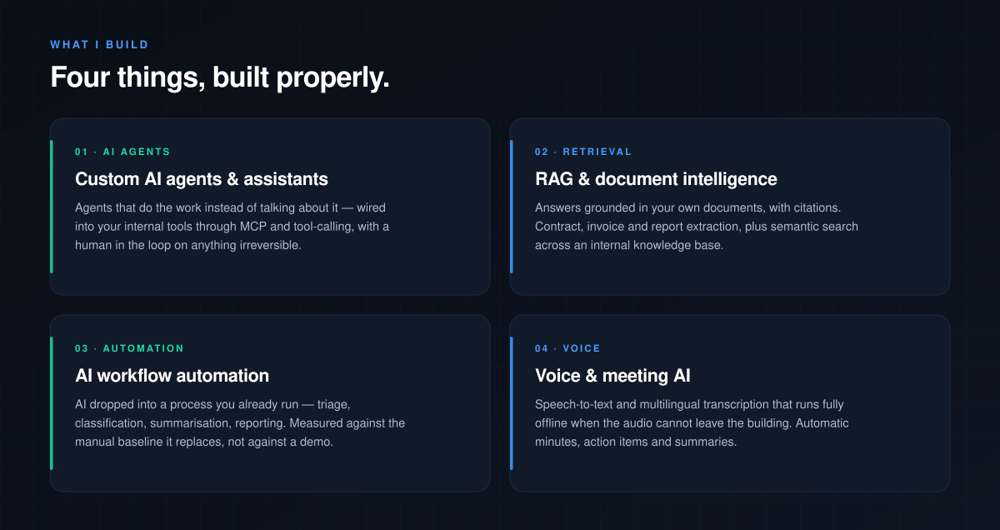
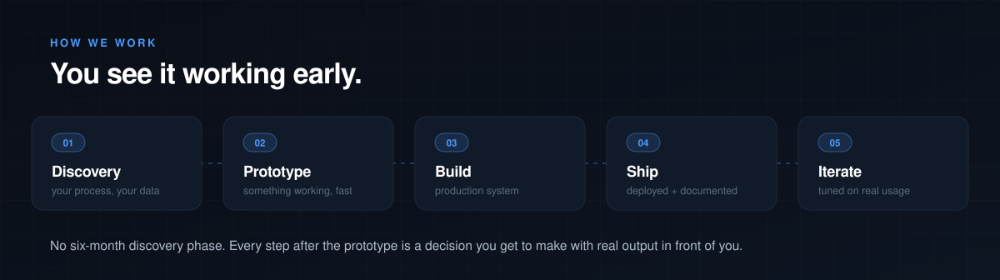
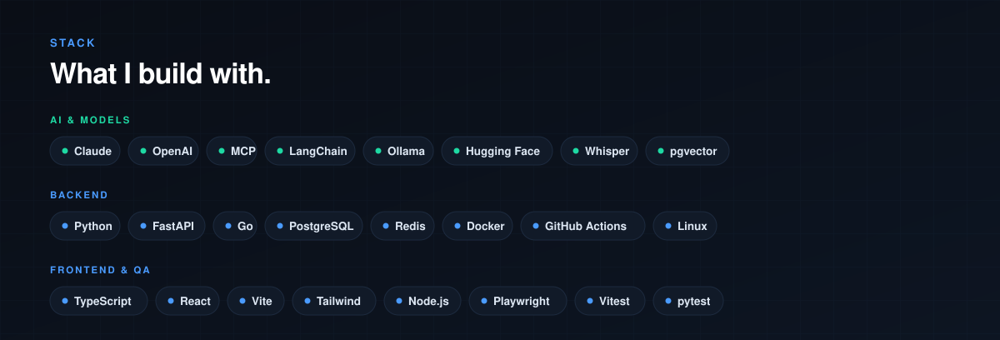
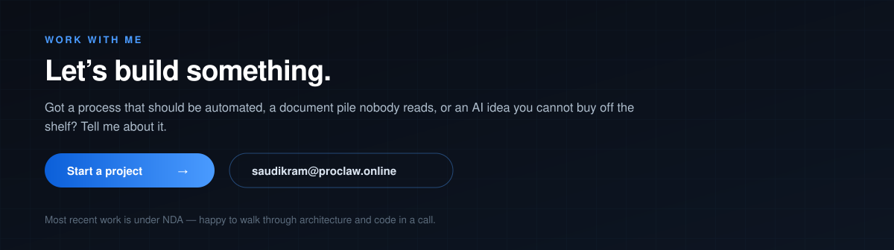

## AI that survives contact with production

Anyone can demo a prompt. The hard part is the system around it — and that's the part I'm good at.

- **Tested like infrastructure.** A recent backend runs **3,277 statements at 100% line + branch coverage** behind a hard CI gate — no `pragma: no cover`, no exclusions — with `mypy --strict` and `ruff` clean on every commit.
- **Designed before it's built.** That system had **17 component specs and 56 architecture diagrams** written before the first line of code.
- **Safe by default.** Secrets envelope-encrypted at rest, append-only audit trails, idempotent writes, kill switches, and human approval on every irreversible action.
- **Yours at the end.** Documented, containerised, and handed over — no black box, no lock-in to me.

