&nbsp;

Text version

 

**I build custom AI applications around your business.** Off-the-shelf AI is built for everyone, which means it's built for no one. I build the other kind — shaped around your process, your data and your tools.

**What I build**

- **Custom AI agents & assistants** — agents that do the work instead of talking about it, wired into your internal tools through MCP and tool-calling, with a human in the loop on anything irreversible.
- **RAG & document intelligence** — answers grounded in your own documents, with citations. Contract, invoice and report extraction, plus semantic search across an internal knowledge base.
- **AI workflow automation** — AI dropped into a process you already run: triage, classification, summarisation, reporting. Measured against the manual baseline it replaces, not against a demo.
- **Voice & meeting AI** — speech-to-text and multilingual transcription that runs fully offline when the audio cannot leave the building. Automatic minutes, action items and summaries.

**How we work** — Discovery → Prototype → Build → Ship → Iterate. No six-month discovery phase; you see something working early.

**Stack** — Claude, OpenAI, MCP, LangChain, Ollama, Hugging Face, Whisper, pgvector · Python, FastAPI, Go, PostgreSQL, Redis, Docker, GitHub Actions, Linux · TypeScript, React, Vite, Tailwind, Node.js, Playwright, Vitest, pytest.

**Why clients keep me**

- **Tested like infrastructure** — a recent backend runs 3,277 statements at 100% line + branch coverage behind a hard CI gate, no exclusions, with `mypy --strict` and `ruff` clean on every commit.
- **Designed before it's built** — 17 component specs and 56 architecture diagrams written before the first line of code.
- **Safe by default** — secrets envelope-encrypted at rest, append-only audit trails, idempotent writes, kill switches, human approval on every irreversible action.
- **Yours at the end** — documented, containerised and handed over. No black box, no lock-in to me.

Most recent work is under NDA — happy to walk through architecture and code in a call.
[sickteck.online](https://sickteck.online/) · [saudikram@proclaw.online](mailto:saudikram@proclaw.online)

